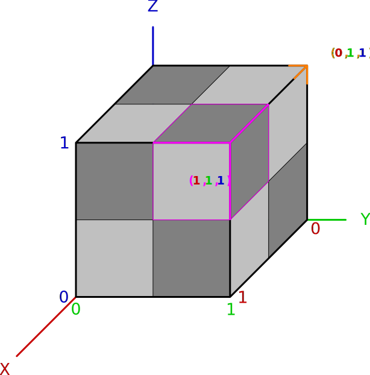
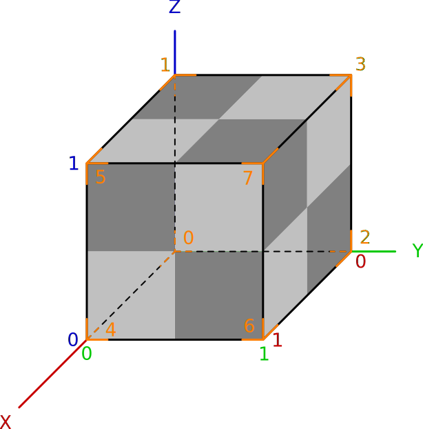
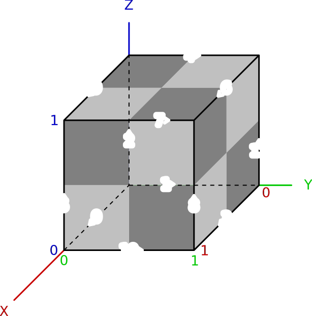
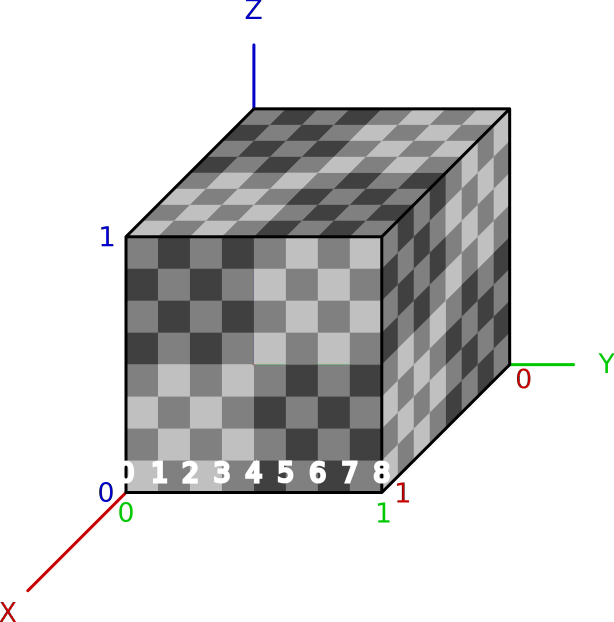

Octree File Format
==================

The Inexor octree format describes the structure of the maps (and even models) created in Inexor.

Octree
------

The orange are coordinates of the corner, the pink of the block.

The position of a block is always the ``(0, 0, 0)`` corner coordinates.

**Corner and Block Order**

If blocks or corners are ordered, they use this order.

.. csv-table:: Corner and Block Order
    :header: ID, Coordinate

    0, "(0, 0, 0)"
    1, "(0, 0, 1)"
    2, "(0, 1, 0)"
    3, "(0, 1, 1)"
    4, "(1, 0, 0)"
    5, "(1, 0, 1)"
    6, "(1, 1, 0)"
    7, "(1, 1, 1)"

**Edge Order**

- All edges are going into the positive direction of the axis.
- The beginning of the edge is always the smaller corner id.
- If you look at a face, the edges are always numbered with an offset of 3.
- The edges are ordered counter-clockwise starting from the axis.
- A negative ID indicates the reverse direction (-axis).

.. csv-table:: Edge Order
    :header: ID, Corner ID Tuple

    0, "(0, 4)"
    1, "(0, 2)"
    2, "(0, 1)"
    3, "(2, 6)"
    4, "(1, 3)"
    5, "(4, 5)"
    6, "(3, 7)"
    7, "(5, 7)"
    8, "(6, 7)"
    9, "(1, 5)"
    10, "(4, 6)"
    11, "(2, 3)"

**Indetation**

Every cube can be indented at each corner to all axis by 8 steps. In total there are 9 position/level on each axis.
The following diagram shows the indentation levels of Corner 1 on the x-axis.

**Neighbours**

.. csv-table:: Neighbour Order
    :header: ID, Relative Coordinates

    0, "(-1, -1, -1)"
    1, "(-1, -1, 0)"
    2, "(-1, -1, 1)"
    3, "(-1, 0, -1)"
    4, "(-1, 0, 0)"
    5, "(-1, 0, 1)"
    6, "(-1, 1, -1)"
    7, "(-1, 1, 0)"
    8, "(-1, 1, 1)"
    9, "(0, -1, -1)"
    10, "(0, -1, 0)"
    11, "(0, -1, 1)"
    12, "(0, 0, -1)"
    13, "(0, 0, 1)"
    14, "(0, 1, -1)"
    15, "(0, 1, 0)"
    16, "(0, 1, 1)"
    17, "(1, -1, -1)"
    18, "(1, -1, 0)"
    19, "(1, -1, 1)"
    20, "(1, 0, -1)"
    21, "(1, 0, 0)"
    22, "(1, 0, 1)"
    23, "(1, 1, -1)"
    24, "(1, 1, 0)"
    25, "(1, 1, 1)"

Format Specification
--------------------

Using this :doc:`binary format syntax </development/reference/binary-format-specification>`.

**Cube Types**

0 - EMPTY
    The cube does not exist, nothing to render.
1 - SOLID
    One solid cube.
2 - NORMAL
    An indented cube, with at least one intended corner.
3 - OCTANT
    The octree is subdivided into 8 sub cubes.

.. note::

    The Format numbers are just to difference between the formats and not to describe an versioning.

Relative comparison about how many bits are used when saving the specific structure.

.. raw:: html
    :file: radar.html

Sauerbraten
^^^^^^^^^^^

This part only shows, how Sauerbraten saves the octrees in general. It does not show the whole format.

.. code-block::

    | ENDIANNESS : little
    | bit : 1 // A bit, 0 or 1.
    | uByte : 8 // An unsigned byte.

    def get_cube() {
        > bit (2) uByte : cube_type // cube type, actually 8 bits are used, but only 4 types can be compared
        switch (cube_type) {
            case 0: // octant
                break // nothing
            case 1: // empty
                break // nothing
            case 2: // solid
                break // nothing
            case 3: // normal
                for corner_number in 0..11 {
                    > uByte (1) // edge indent
                }
                break
        }
    } // get_cube
    get_cube()

Inexor I
^^^^^^^^

File Extension: ``.nxoc`` - Inexor Octree

.. code-block::

    | ENDIANNESS : little
    | bit : 1 // A bit, 0 or 1.
    | uByte : 8 // An unsigned byte.
    | uInt : 32 // An unsigned integer.

    > uByte (13) // string identifier: "Inexor Octree"
    > uInt (1) // version

    def get_cube() {
        > bit (2) uByte : cube_type // cube type

        switch (cube_type) {
            case 0: // empty
                break // nothing
            case 1: // fully
                break // nothing
            case 2: // indented
                for corner_number in 0..7 {
                    > bit (1) : x_axis // is x axis indented
                    if (x_axis == 1) { // x axis is indented
                        > bit (3) // indentation level as value + 1
                    }
                    > bit (1) : y_axis // is y axis indented
                    if (y_axis == 1) { // y axis is indented
                        > bit (3) // indentation level as value + 1
                    }
                    > bit (1) : z_axis // is z axis indented
                    if (z_axis == 1) { // z axis is indented
                        > bit (3) // indentation level as value + 1
                    }
                }
                break
            case 3: // octants
                for sub_cube in  0..7) {
                    get_cube() // recurse down
                }
                break
        }
    } // get_cube
    get_cube()

The corner position at one axis is calculated relative from the corner starting as 0 + indentation level.

Inexor II
---------
File Extention: ``.nxoc`` - Inexor Octree

.. code-block::

    | ENDIANNESS : little
    | bit : 1 // A bit, 0 or 1.
    | uByte : 8 // An unsigned byte.
    | uInt : 32 // An unsigned integer.

    > uByte (13) // string identifier: "Inexor Octree"
    > uInt (1) // version

    def get_cube() {
        > bit (2) uByte : cube_type // cube type

        switch (cube_type) {
            case 0: // empty
                break // nothing
            case 1: // fully
                break // nothing
            case 2: // indented
                for edge_id in 0..11 {
                    > bit (2) uByte : indent // edge indentation
                    switch (indent) {
                        case 0: // not indented
                            break
                        case 1: // end corner is indented
                        case 2: // start corner is indented
                            > bit (3) // indentation offset, starting from the specified corner
                            break
                        case 3: // both sides indented
                            > bit (5) // indentation level and offset, see below for more information
                    }
                }
                break
            case 3: // octants
                for sub_cube in  0..7) {
                    get_cube() // recurse down
                }
                break
        }
    } // get_cube
    get_cube()

**Edge Indentation**

Each corner can be indented 8th times per axis. The indentation level can be (including) 0 to 8.

All numbers are natural numbers (including 0).

**Calculating edge indentation value**

The indentation along the edge axis between two corners presented by one value. The indentation level starts with 0 at the starting corner and goes to 8 at the ending corner.

Using :math:`e_\mathit{id\_s}` as the indentation level of the edge starting corner and :math:`e_\mathit{id\_o}` is the offset to the indentation level of the ending corner.

:math:`e_\mathit{id} = 8 * e_\mathit{id\_s} + e_\mathit{id\_o} - \frac{e_\mathit{id\_s}^2 + e_\mathit{id\_s}}{2}; e_\mathit{id\_s}, e_\mathit{id\_o} \in [0, 6]; e_\mathit{id\_s} <= e_\mathit{id\_o}`

:math:`i = 8 * s + o - \frac{s^2 + s}{2}; s, o \in [0, 6]; s <= o`

Resulting into values from 0 to 27.
